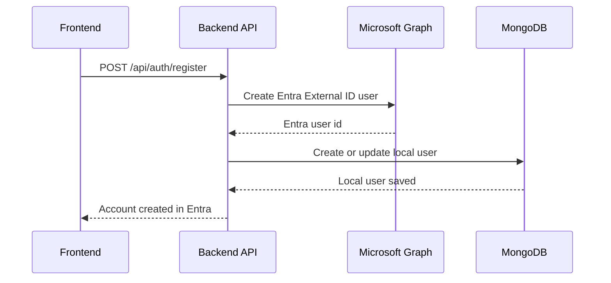
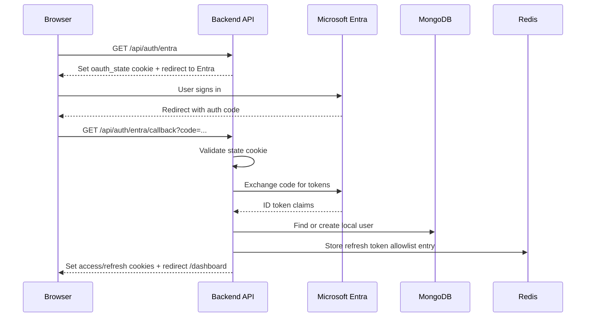

# Authentication Process Flow

This project uses Microsoft Entra External ID for identity and sign-in.

Core requirement implemented:

1. User registers in this app with required details.
2. Backend creates that account in Entra External ID.
3. User signs in using Microsoft Entra.

OTP is not required for the core login/registration flow.

---

## High-Level Model

- Entra account: the identity account created in Microsoft Entra External ID.
- Local app user: optional app profile/role mirror in MongoDB.
- App session: the JWT access token and refresh token stored in HttpOnly cookies.

This means Entra is the source of authentication, while the backend still manages app session cookies and optional local app data.

---

## Direct Registration Flow

The direct registration form creates the account in Entra first, then mirrors it into the local database.

### What happens

1. The frontend registration form submits `email`, `displayName`, optional name fields, and `password` to `POST /api/auth/register`.
2. The backend validates that Entra is configured.
3. The backend calls Microsoft Graph and creates a local Entra account in the External tenant.
4. The backend optionally saves or updates a matching local MongoDB user with `entraExternalId` set to the Entra user id.
5. The API returns a success message telling the user to continue with Microsoft sign-in.

### Important detail

Registration does not immediately create an app session. It provisions the Entra identity first. The user then signs in through the Entra login flow, and only after that does the app issue its own cookies.

### Sequence

---

## OTP Note

OTP can exist as an optional add-on flow, but it is not required for the Entra-first requirement and is not part of the primary registration and login path.

## Entra Login Flow

The Microsoft sign-in button starts an OAuth/OpenID Connect flow through the backend.

### What happens

1. The frontend redirects the browser to `GET /api/auth/entra`.
2. The backend generates a random `state` value and stores it in a short-lived cookie.
3. The backend builds an MSAL authorization URL and redirects the browser to Microsoft.
4. The user signs in on the Entra-hosted page.
5. Microsoft redirects back to `GET /api/auth/entra/callback` with an authorization code.
6. The backend validates the `state` cookie to prevent CSRF.
7. The backend exchanges the code for tokens using MSAL.
8. The backend reads the Entra claims, especially the user id and email.
9. The backend finds or creates the optional local app user and links it with `entraExternalId`.
10. The backend issues its own access token and refresh token.
11. The backend stores those tokens in HttpOnly cookies and redirects the user to the dashboard.

### Sequence

---

## How Entra Creation Works

User creation in Entra happens through Microsoft Graph using application permissions.

The backend sends a request to Graph's `/users` endpoint with:

- `identities.signInType = emailAddress`
- `identities.issuer = <tenant>.onmicrosoft.com`
- `identities.issuerAssignedId = user's email`
- `passwordProfile.password = submitted password` for direct registration, or a generated password for OTP provisioning

This is why the Entra setup requires application permissions such as `User.ReadWrite.All` and `Organization.Read.All`.

---

## How App Login Works After Entra Authentication

After Entra authenticates the user, the backend does not reuse the Entra token directly for app authorization.

Instead, it does the following:

1. Creates a short-lived app access token.
2. Creates a longer-lived refresh token.
3. Stores refresh token state in Redis.
4. Sends both tokens as HttpOnly cookies.

The app then uses those cookies for:

- protected API access
- session restore on page load
- refresh token rotation
- logout and token revocation

This keeps the application session model independent from the Microsoft token lifecycle.

---

## Files Involved

- `frontend/src/services/authService.js`: starts registration and Entra login requests.
- `backend/src/routes/auth.js`: main registration, callback, session, refresh, and logout routes.
- `backend/src/services/entraUserService.js`: Microsoft Graph user creation and lookup.
- `backend/src/config/msal.js`: MSAL auth URL and code exchange logic.
- `backend/src/services/tokenService.js`: app JWT issuance, cookie handling, and refresh rotation.

---

## Short Summary

- Direct registration creates the user in Entra first, then optionally mirrors that user locally.
- Entra login authenticates the user with Microsoft, then the backend creates the app session.
- OTP is optional and not part of the core requirement flow.
- Redis is used to manage refresh token validity for logout and rotation.