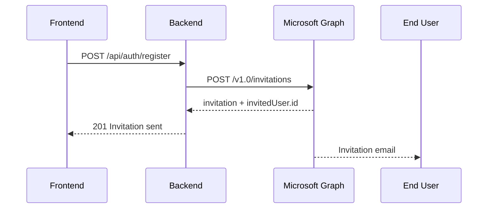
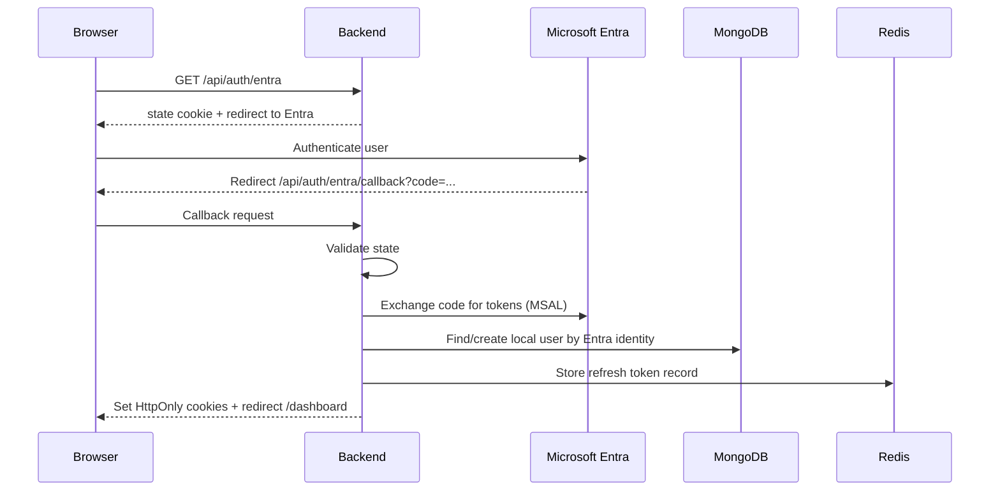

# Authentication Process Flow

This document describes the currently working, invitation-based flow.

## Core Flow

1. User submits register form (`email`, `displayName`, optional names).
2. Backend sends invitation using Microsoft Graph `/invitations`.
3. User receives invitation email and accepts it.
4. User clicks Sign in with Microsoft in the app.
5. Backend handles OAuth callback, creates/updates local user, issues app cookies.

No password is collected on app registration.

## Actors

- Frontend app (React)
- Backend API (Express)
- Microsoft Entra External ID
- Microsoft Graph API
- MongoDB (local user mirror)
- Redis (refresh token lifecycle)

## Invitation Registration Sequence

## Microsoft Sign-In Sequence

## Session Model

After successful Entra authentication, backend issues app tokens:

- Access token: short-lived
- Refresh token: long-lived, rotated and revocable

Both are sent as HttpOnly cookies.

## Endpoints Involved

- `POST /api/auth/register` -> send invitation
- `GET /api/auth/entra` -> start OAuth flow
- `GET /api/auth/entra/callback` -> complete OAuth flow
- `GET /api/auth/session` -> check active session
- `POST /api/auth/refresh` -> rotate refresh token
- `POST /api/auth/logout` -> revoke refresh + clear cookies

## Required Entra/Graph Permissions

Application permissions used by invitation flow include:

- `User.Invite.All`
- `User.Read.All`
- `Organization.Read.All`

Admin consent must be granted in the same tenant configured in `ENTRA_TENANT_ID`.

## Optional Legacy Paths

OTP and password-reset endpoints still exist, but they are optional and not required for the invitation-based core flow.
